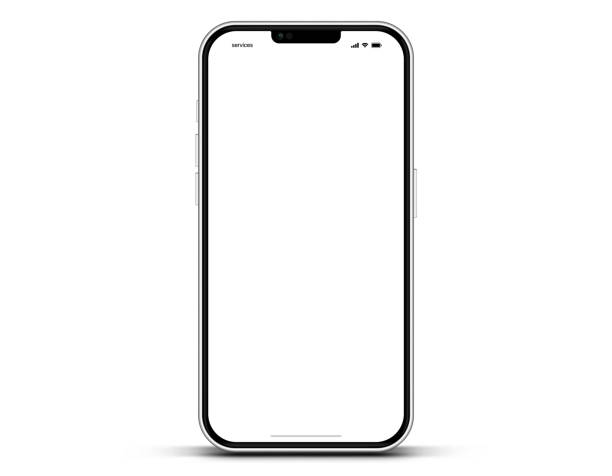

# Tienda Tecnológica
Este reto semanal consiste en desarrollar una página web para una tienda de productos electrónicos, aplicando HTML semántico y estilos CSS personalizados. El objetivo es consolidar el uso de estructuras modulares, diseño responsive y buenas prácticas visuales, como parte del Bootcamp de Desarrollo Web Fullstack.

# Reto Semana 10
Implementar una página web que incluya:
- Encabezado con logotipo y navegación horizontal.
- Sección principal con título y párrafo introductorio.
- Catálogo de productos en cuadrícula con imágenes, descripciones y botones de compra.
- Sección de testimonios con citas estilizadas.
- Pie de página con formulario de contacto express.
- Efectos hover en navegación, imágenes y botones.
- Diseño responsive para dispositivos móviles.

# Tecnologías
- HTML5
- CSS
- Fuentes: Google Fonts

# Estructura del Proyecto
```
retoSemana10/

├── index.html
├── README.md
└── assets/
    ├── CSS/
    │   └── main.css
    ├── img/
    │   ├── celular.jpg
    │   ├── computador.jpg
    │   ├── tablet.jpg
    │   ├── monitor.jpeg
    │   └── favicon.svg
    └── js/
```
# Cómo usar
1. Abre el archivo index.html en tu navegador.
2. Navega por las secciones: bienvenida, productos, testimonios y contacto.
3. Interactúa con los botones de compra y el formulario de contacto.
4. Observa el diseño responsive en distintos tamaños de pantalla.

# Ejemplo de contenido
```
<header>
  <section id="ini" class="bienvenida">
    <h1 class="titulo-principal">Bienvenido a Nuestra Tienda Tecnológica</h1>
    <p class="intro">Explora nuestra selección de dispositivos electrónicos de última generación...</p>
  </section>
</header>

<section id="prod" class="productos">
  <article class="producto">
    
    <h2>Smartphone X1</h2>
    <p class="descripcion">Pantalla OLED de 6.5", batería de larga duración...</p>
    <button>Comprar</button>
  </article>
</section>
```
# Resultado


